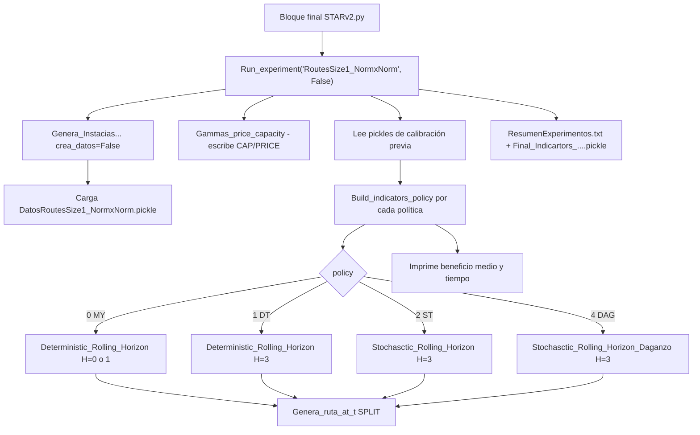

# Documentación de `STARv2.py` — corrida `RoutesSize1_NormxNorm`

Documento para alguien que abre el código por primera vez. El hilo conductor es **la corrida que está ejecutándose ahora**. El resto del archivo (otras funciones de experimento, calibración, variantes de modelo) se explica porque el flujo las toca o las carga, aunque en esta ejecución no se reentrenen.

Archivo principal: `STARv2.py` (~3300 líneas, un solo módulo).  
Script auxiliar que **no** se usa en esta corrida: `Daganzo.py` (prototipo suelto de bounding box; el modelo Daganzo real está dentro de `STARv2.py`).

---

## 1. Qué problema resuelve el código

Un comprador debe abastecer varios productos perecederos a lo largo de un horizonte de días. Cada día observa demanda, precios y cantidades disponibles de los proveedores, decide **a quién visitar y cuánto comprar**, y un vehículo (o flota) recorre a esos proveedores. Lo que no se vende se guarda con merma y pasa al día siguiente. Lo que no se cubre se paga como *backorder*.

El ruteo exacto dentro del MIP de compra es caro. Por eso el modelo de decisión **no resuelve un VRP completo** (salvo una variante). En su lugar cobra un costo de visita aproximado:

\[
C_{i,t}^{\text{MIP}} = \gamma_i \,(c_{0i}+c_{i0})
\]

\(\gamma_i \in (0,1]\) es la fracción del viaje ida-vuelta que se imputa al proveedor \(i\). Si \(\gamma_i=1\), visitarlo cuesta el round-trip completo (como si fuera el único en la ruta). Si \(\gamma_i\) es pequeño, se asume que comparte ruta y “sale barato” insertarlo. Después de decidir las compras del día, un **heurístico de ruteo** construye las rutas reales y el costo verdadero entra al indicador de la política.

Objetivo diario (y del MIP), con \(\alpha=0.5\):

\[
\max \quad \alpha\,(\text{ingreso} - \text{compra} - \text{backorder}) - (1-\alpha)\,\text{costo de ruta}
\]

---

## 2. Qué corrida está ejecutándose ahora

Al final de `STARv2.py` (aprox. líneas 3241–3321) no se llama a las funciones `distribution_experiments()`, `experiments_longer_route()`, etc. Se ejecuta un bloque suelto equivalente a **un solo caso** de “rutas más largas”, el de factor 1 (caso base).

| Parámetro | Valor en esta corrida | Significado |
|---|---|---|
| `name_exp` | `RoutesSize1_NormxNorm` | Nombre de instancia y de archivos pickle |
| `complex_route_values` | `[1]` | Multiplicador de jornada y capacidad de vehículo |
| `daily_time` | \(480 \times 1 = 480\) | Minutos de jornada |
| `veh_factor` (`Q`) | \(60 \times 1 = 60\) | Capacidad del vehículo (centenas de kg) |
| `Vertex` | 21 | Depósito + 20 proveedores |
| `Products` | 5 | Productos |
| `Periods` | 20 | Días |
| `perish` | 0.1 | Merma diaria: el inventario pasa como \(I_{t+1}=(1-0.1)I_t^{\text{final}}\) |
| `dist_train` / `dist_eval` | `Norm` / `Norm` | Precio, oferta y demanda normales |
| `crea_datos` | `False` | **No** genera instancias; las carga |
| `calibra` | `False` | **No** reentrena gammas/H/theta/Daganzo; lee pickles ya calibrados |
| `flag_routing` | `SPLIT` | Tras el MIP: vecino más cercano + split de Beasley |
| `lo_eval`, `up_eval` | 90, 120 | Evalúa sample paths 90…119 (30 réplicas) |
| `replicates` | 1 | Una semilla para las políticas ST |
| `sample_paths` | 10 | Escenarios en el lookahead estocástico |
| `MIP_gap` | 0.05 | Gap de Gurobi |
| `alpha` | 0.5 | Peso ingreso vs. ruta |
| `flag_demand_cero_t_0` | `True` | Demanda del día 0 es cero (se compra para el futuro) |
| `increase_offering` | 0.3 | Cada producto lo ofrecen ~30% de los proveedores |
| `increase_route` | 1 | Un minuto de ruta vale un dólar |
| `revenue_dist` | 0.1 | Precio de venta = 1.1 × precio medio de compra |
| `seedd` | 10 | Semilla de la instancia (cuando se genera) |
| `T_aux` | `False` | Recorre todo el horizonte, no solo el primer día |
| `flag_dif_routing` | `False` | No compara SPLIT vs EXACT en cada día |

En consola el nombre de cada política lleva el sufijo `RoutesSize1_NormxNorm`. Ejemplo: `ST_BG_RoutesSize1_NormxNorm`.

Esta corrida es **evaluación out-of-sample** sobre una instancia ya creada y unos hiperparámetros ya calibrados. El “entrenamiento” de gammas **ya ocurrió** en una ejecución previa con `calibra = True`.

---

## 3. Paquetes y entorno

### Imprescindibles para esta corrida

| Paquete | Uso |
|---|---|
| Python 3.12 (la corrida actual usa `C:/Python312/python.exe`) | Intérprete |
| `numpy` | Muestreo, álgebra, semillas |
| `pandas` | Solo set-partitioning (no entra en `SPLIT`) |
| `gurobipy` | MIP de inventario / lookahead |
| `pickle` | Carga de instancia y calibración |
| `re` | Parseo del nombre del experimento (`RoutesSize1_NormxNorm` → train/eval) |
| Licencia Gurobi | En consola aparece *Academic license* |

Gurobi es **obligatorio**. Sin licencia el script no resuelve ningún MIP.

### Importados pero no necesarios para *esta* corrida

| Paquete / pieza | Cuándo se usaría |
|---|---|
| `pyomo` + solver `gurobi` | Ruteo `flag_routing = 'SP'` (set partitioning) |
| `scipy.optimize.minimize` | Convertir media/std a parámetros LogNorm/Triang/Uniform al **crear** datos |
| `networkx`, `matplotlib`, `seaborn` | Graficar rutas (`Grafica_Ruta`); no se llama al final |
| Ejecutable LKH en `c:\LKH` | Ruteo `flag_routing = 'LKH'` |
| `csv` | No se usa de forma central |

No hay `requirements.txt`. Instalación mínima típica:

```text
pip install numpy pandas gurobipy pyomo scipy networkx matplotlib seaborn
```

Más una instalación de Gurobi con licencia.

---

## 4. Cómo está organizado el archivo

El módulo es monolítico. Orden aproximado:

1. Imports y flags globales `crea_datos`, `calibra`
2. `generate_new_distribution_parameters` — convierte \((\mu,\sigma)\) a parámetros de otra familia
3. **Ruteo:** `Set_Partitioning`, `LKH`, `Graph` (Bellman-Ford), vecino más cercano, split, CVRP exacto
4. **Evaluación:** `Build_indicators_policy`
5. **Instancias:** `Genera_Instacias_Stochastic_with_parameters_fixed`
6. **Modelos de rolling:** determinístico, estocástico Daganzo, estocástico \(x_{ij}\), estocástico \(\gamma\)
7. **Calibración / aprendizaje de gammas**
8. **Orquestación:** `Run_experiment`
9. **Familias de experimentos** (funciones que *no* se llaman ahora)
10. **Bloque ejecutable** (esta corrida)



---

## 5. Flujo de esta corrida, paso a paso

`Run_experiment(name_exp, bandera_cosas)` con `bandera_cosas = calibra = False`.

### 5.1 Cargar la instancia

Llama a `Genera_Instacias_Stochastic_with_parameters_fixed(...)`. Como `crea_datos` es `False` y `dist_train == dist_eval`, abre:

```text
DatosRoutesSize1_NormxNorm.pickle
```

Devuelve conjuntos (`V`, `M`, `K`, `T`), coordenadas, quién ofrece qué (`Mk`, `Km`), realizaciones \(d,p,q\) por sample path, esperanzas \(d_{EV},p_{EV},q_{EV}\), costos de viaje \(c_{ij}\), parámetros de distribución y las versiones ya transformadas `d_log`, `p_log`, `q_log` (aquí coinciden con Normal).

### 5.2 Armar gammas de precio y capacidad

`Gammas_price_capacity` **sí se ejecuta siempre** (no está detrás de `calibra`). Recalcula y **sobrescribe**:

```text
Gammas_capacity_RoutesSize1_NormxNorm.pickle
Gammas_price_RoutesSize1_NormxNorm.pickle
```

Regla: un proveedor “atractivo” (más cantidad que el promedio del producto, o más barato que el promedio) recibe un \(\gamma\) **más pequeño**, así el MIP lo visita con más ganas.

### 5.3 Cargar calibración previa (no se reentrena)

Como `calibra` es `False`, se saltan:

- `tunning_C_daganzo`
- `H_size_and_gamma_performance`
- `theta_tunning_myopic`
- `gamma_distance_performance`
- `Learning_gamma_performance` (estocástico y miópico)

Pero **sí se leen** los pickle que esas rutinas habrían escrito. El nombre se recorta con `re.split('x', ...)` para, en experimentos *train × eval* distintos, usar siempre la calibración del **train**. Aquí train = eval = `Norm`, así que el archivo es el del propio experimento.

| Se carga | Contenido que se extrae |
|---|---|
| `C_Daganzo_RoutesSize1_NormxNorm.pickle` | Par \((C, k)\) de Daganzo con mejor FO. En consola: `[1, 0.95]` |
| `Obj_gammas_RoutesSize1_NormxNorm.pickle` | FO vs \(\gamma \in \{0.1,\ldots,1\}\) para MY, DT, ST → `best_gamma_MY/DT/ST` |
| `Thetas_myopic_RoutesSize1_NormxNorm.pickle` | Mejor \(\theta\) del miópico con demanda inflada. En consola: `1` |
| `Obj_times_RoutesSize1_NormxNorm.pickle` | Mejor umbral de distancia (minutos) para gammas geográficos |
| `historial_gammas_RoutesSize1_NormxNorm.pickle` | Vectores \(\gamma_i\) aprendidos con lookahead ST, \(H=3\) |
| `historial_gammas_myopic_RoutesSize1_NormxNorm.pickle` | Igual, aprendidos con \(H=0\) |
| `Gammas_capacity_...` / `Gammas_price_...` | Los que acaba de escribir el paso 5.2 |

De esos historiales toma **el último vector de la última iteración** (no necesariamente el de mejor FO intermedia):

- `gammas_one` ← aprendizaje ST inicializado en \(\gamma=1\)
- `gammas_cero` ← inicializado en \(\gamma=0\)
- `gammas_BG` ← inicializado en `best_gamma_ST`
- `gamma_DDMY` ← promedio de \(\gamma_i\) observados con ST y \(H=0\)
- análogos `_MY` para el aprendizaje miópico

`gammas_avg3` = promedio aritmético de (capacidad, precio, distancia) por proveedor.

### 5.4 Evaluar políticas

`Build_indicators_policy` recorre `sample = 90 … 119`. Por cada sample:

1. Corre el rolling horizon de esa política.
2. En cada día, tras el MIP, llama a `Genera_ruta_at_t` (`SPLIT`).
3. Acumula compra, inventario, ruta, profit, backorders, etc.

Imprime `nombre_politica`, luego `beneficio_medio tiempo_medio`.

Orden real de esta corrida:

1. `MY_BG_` — miópico, un \(\gamma\) uniforme óptimo  
2. `MY_BG_T1` — miópico, gammas aprendidos desde 1  
3. `MY_BG_T0` — miópico, gammas aprendidos desde 0  
4. `MY_BG_TBG` — miópico, gammas aprendidos desde best \(\gamma\) MY  
5. `MY_BG_Theta` — miópico con \(H=1\) y demanda futura \(\times\theta\)  
6. `DT_BG_` — lookahead determinístico \(H=3\)  
7. `ST_BG_` — lookahead estocástico \(H=3\), \(\gamma\) uniforme óptimo  ← **aquí iba la corrida al documentar**  
8. `ST_T1_` … `ST_T0_` … `ST_TBG_` … `ST_D_` … `ST_DDMY_` … `ST_CAP_` … `ST_PRICE_` … `ST_AVG3_` … `ST_DAG_`

Al terminar la réplica escribe dos líneas en `ResumenExperimentos.txt` (FO y tiempos) y guarda `Final_Indicartors_RoutesSize1_NormxNorm.pickle`.

El guardado detallado por política (`nombre_90,120.pickle`) está **comentado**.

---

## 6. Instancias: dónde se generan y dónde se cargan

Todo pasa por `Genera_Instacias_Stochastic_with_parameters_fixed` (aprox. línea 981).

### Si `crea_datos == True` (no es esta corrida)

Con semilla `seedd`:

1. Coordenadas uniformes en un grid `size_grid × size_grid`; el depósito en el centro.
2. Oferta: cada producto \(k\) lo ofrecen \(\lceil(|M|) \times\) `increase_offering`\(\rceil\) proveedores aleatorios (`Mk`, `Km`). El patrón del día 0 se copia a todos los días.
3. Precio y cantidad: media uniforme en \([50,120]\) y \([4,9]\); \(\sigma = 0.1 \times\) media. Opcionalmente correlacionados entre productos del mismo proveedor (`flag_correlated_price/cap`).
4. `generate_new_distribution_parameters` adapta esos \((\mu,\sigma)\) a `dist_train`.
5. 200 sample paths (`paths_evaluation`): realiza \(p,q,d\) por día. Día 0 de demanda = 0 si `flag_demand_cero_t_0`.
6. \(c_{ij}\) = distancia euclídea + `time_per_supplier` (10 min) si \(j\) no es depósito.
7. Ingreso \(r_{EV}[k] = \overline{p}(1+\) `revenue_dist`\()\). Penalización de backorder \(bo_{EV}[k] = 2.5 \times 100 \times \overline{p}\).
8. Guarda `Datos{name_exp}.pickle`.

### Si `crea_datos == False` (esta corrida)

- Mismo train y eval: un solo pickle, se usan sus \(d,p,q\) tal cual.
- Train ≠ eval (otros experimentos): carga `Datos{prefijo}_{train}x{train}.pickle` y `Datos{prefijo}_{eval}x{eval}.pickle`. Los indices `lo_eval ≤ sample < up_eval` se sustituyen por las realizaciones de **eval**; el resto (calibración) queda en **train**.

Los sample paths 0–89, 120–199 son, por diseño de calibración, los que se usaron para tunear. La evaluación de esta corrida (90–119) está **fuera** de esos rangos de calibración:

| Rutina de calibración | Samples |
|---|---|
| `H_size_and_gamma_performance` | 0–19 |
| `gamma_distance_performance` | 30–49 |
| `Learning_gamma_performance` | 60–79 |
| Evaluación ahora | **90–119** |
| `theta_tunning_myopic` | 120–139 |
| `tunning_C_daganzo` | 130–149 |

---

## 7. Horizonte rodante (idea común a todas las políticas)

En el día `t_RH`:

1. Ventana `TT = {t_RH, …, min(t_RH+H, T-1)}`.
2. El **día de hoy** entra con la realización verdadera del sample `s`: \(d_{k,t_RH,s}\), \(p_{i,k,t_RH,s}\), \(q_{i,k,t_RH,s}\).
3. Los **días futuros** de la ventana se rellenan según la política (esperanza, escenarios, o demanda \(\times\theta\)).
4. Se resuelve un MIP de inventario + visitas (costo de ruta aproximado).
5. Solo se **implementa** la decisión de `t_RH`: quién se visita y cuánto se compra hoy.
6. `Genera_ruta_at_t` rutea a esos proveedores (SPLIT).
7. Inventario final, con merma `per_por`, es el \(I_0\) de mañana.
8. Se avanza un día y se repite.

`H = 0` ⇒ miópico (solo hoy).  
`H = 3` ⇒ mira hoy y tres días más (o hasta el final del horizonte).

---

## 8. Modelo determinístico / miópico

**Dónde:** `Deterministic_Rolling_Horizon` (aprox. línea 1333).  
**Solver:** Gurobi, modelo `'Inventory'`.  
**Lo usan:** todas las políticas `MY_*` (`policy=0`) y `DT_BG` (`policy=1`).

### Variables (por día \(t\) de la ventana)

| Variable | Tipo | Significado |
|---|---|---|
| \(z_{ikt}\) | continua | cantidad comprada del producto \(k\) al proveedor \(i\) en \(t\) |
| \(w_{it}\) | binaria | se visita \(i\) en \(t\) |
| \(i_{kt}\) | continua | inventario de \(k\) al final de \(t\) |
| \(bo_{kt}\) | continua | faltante de \(k\) en \(t\) |

### Restricciones clave

- Balance de inventario en \(t_{RH}\): \(I_0 + \sum z - d + bo = i\).
- Días siguientes: \(i_{t} = (1-\text{perish})\,i_{t-1} + \sum z - d + bo\).
- \(z_{ikt} \le q_{ikt} w_{it}\) (solo compras si visitas).
- \(\sum_k z_{ikt} \le Q\) (capacidad del vehículo por parada, no de la ruta).
- \((c_{0i}+c_{i0}) w_{it} \le\) `daily_time`.

### Cómo se llena el futuro

| Caso | Demanda futura | Precio / oferta futuros |
|---|---|---|
| `flag_policy=False` (MY estándar y DT) | \(d_{EV}\) | \(p_{EV}\), \(q_{EV}\) |
| `flag_policy=True` (MY Theta) | realización del sample \(\times\theta\) | \(q\) del sample, \(p_{EV}\) |

MY usa `H=0` (excepto Theta, que usa `H=1`). DT usa `H=3`. El MIP de DT **sí** ve varios días, pero esos días futuros son **esperanzas**, no escenarios.

Costo de ruta en el MIP: \(\sum_{i,t} \gamma_i (c_{0i}+c_{i0}) w_{it}\). Tras optimizar, el costo que cuenta para el indicador es el de SPLIT, no el del MIP.

---

## 9. Modelo estocástico (el de esta corrida)

**Dónde:** `Stochasctic_Rolling_Horizon` (aprox. línea 2168).  
**Lo usan:** todas las políticas `ST_*` excepto `ST_DAG` y la variante `xij` (esta última no se llama aquí).

Mismo inventario que el determinístico, pero indexado por escenario \(w = 0,\ldots,9\) (`sample_paths = 10`), equiprobables.

### Hoy vs. futuro

- \(t = t_{RH}\): \(d,p,q\) **iguales en todos los \(w\)** (la realización del sample de evaluación).
- \(t > t_{RH}\): cada \(w\) muestrea de `d_log`, `p_log`, `q_log` con `provides_random_value` y `dist_train` (aquí Normal).

### No anticipatividad en \(t_{RH}\)

Las decisiones de hoy se fuerzan iguales entre escenarios (promedio):

\[
z_{ik,t_{RH},w} = \tfrac{1}{|W|}\sum_{w'} z_{ik,t_{RH},w'}, \quad
\text{igual para } w,\, i,\, bo
\]

Así el comprador no puede “ver” un escenario futuro para decidir el día de hoy. Los días futuros de la ventana **sí** pueden diferir por \(w\) (política de recurso).

Objetivo: esperanza sobre \(w\) de ingreso − compra − backorder − ruta aproximada por \(\gamma\).

Tras el MIP se implementa el escenario `w=0` (que en \(t_{RH}\) coincide con todos) y se rutea con SPLIT. El inventario que pasa al día siguiente sale de `ii[k, t_RH, 0]`.

Al final de cada sample la función **también estima un \(\gamma_i\) realizado**: si el proveedor \(i\) cayó en una ruta, compara el tiempo medio por parada de esa ruta con el round-trip \(c_{0i}+c_{i0}\). Eso es el insumo del aprendizaje de gammas (sección 11), no de la evaluación en sí.

---

## 10. Otras dos formulaciones estocásticas (en el archivo, no en el núcleo ST de esta corrida)

### 10.1 `Stochasctic_Rolling_Horizon_xij` (línea 1852)

Lookahead estocástico con **VRP explícito** dentro del MIP: arcos \(x_{ijvt}\), flota, MTZ, capacidad por vehículo. Mucho más pesado (`TimeLimit` 3600 s). Lo usa `Run_experiment_complexity_model` / `policy==3`. **No** forma parte de `RoutesSize1`.

### 10.2 `Stochasctic_Rolling_Horizon_Daganzo` (línea 1517)

Misma incertidumbre que ST, pero el costo de ruta del MIP **no** es \(\gamma \times\) round-trip. Estima la longitud de las rutas con una fórmula tipo Daganzo sobre el bounding box de los proveedores visitados (área, `width`, `height`, parámetros `sup_per_veh` y `k_factor`). Gurobi en modo no convexo, `TimeLimit=1` por día.

En **esta** corrida sí se evalúa, al final, como política `ST_DAG_`, con el par calibrado `(1, 0.95)`.

`Daganzo.py` en la carpeta es un experimento aparte de bounding box; **no** lo importa `STARv2.py`.

---

## 11. Gammas: qué son y cómo se “entrenan”

### 11.1 Papel en el MIP

Sin VRP dentro del modelo, visitar \(i\) costaría \(c_{0i}+c_{i0}\) (ida y vuelta). En la práctica varios proveedores caben en la misma ruta, así que ese costo sobreestima. \(\gamma_i\) corrige esa sobreestimación. Un \(\gamma_i\) mal calibrado hace que el MIP visite de más (gamma bajo) o de menos (gamma alto).

Hay dos familias:

1. **Un solo \(\gamma\) para todos los proveedores** (`best_gamma_*`).
2. **Un vector \(\gamma_i\)**, uno por proveedor, obtenido por regla o por aprendizaje.

### 11.2 Calibración de un \(\gamma\) uniforme — `H_size_and_gamma_performance`

No corre ahora; el resultado está en `Obj_gammas_...pickle`.

Para cada \(\gamma \in \{0.1,\ldots,1\}\) y samples 0–19:

- MY con \(H=0\)
- DT y ST con \(H \in [3,4)\) es decir **solo \(H=3\)**

Se guarda la FO media. `Run_experiment` toma el \(\gamma\) de mayor FO para MY, DT y ST por separado.

### 11.3 Aprendizaje iterativo por proveedor — `Learning_gamma_performance`

Tampoco corre ahora (`iterations_learning = 60` solo importaría si `calibra=True`).

Para cada pareja \((H, \gamma_0)\) con \(\gamma_0 \in \{1, 0, \text{best }\gamma\}\):

1. Se corre ST (sí, incluso cuando \(H=0\)) en samples 60–79.
2. De cada corrida se extrae el \(\gamma_i\) **realizado** (tiempo medio en ruta / round-trip).
3. Actualización suavizada solo si el proveedor apareció en alguna ruta:

\[
\gamma_i \leftarrow \Bigl(1-\tfrac{1}{\sqrt{n_i}}\Bigr)\gamma_i + \tfrac{1}{\sqrt{n_i}}\,\bar\gamma_i^{\text{obs}}
\]

4. Se guarda el historial de vectores. La evaluación usa el **último** vector.

Después, un bloque extra con \(H=0\) y `best_gamma_MY` promedia los \(\gamma_i\) observados → `gamma_DDMY` (gammas “vistos” en un horizonte miópico, etiquetados DDMY en el código).

Hay dos llamadas cuando se calibra: una con \(H=3\) (archivo `historial_gammas_*`) y otra con \(H=0\) (`historial_gammas_myopic_*`).

### 11.4 Otras reglas de \(\gamma_i\) (sin rolling)

**Distancia** (`gamma_distance_performance`): para un umbral de minutos \(\tau\), \(\gamma_i = 1/(1+\#\{\)vecinos a menos de \(\tau\}\)\). Se elige el \(\tau\) de mejor FO ST. En evaluación: `ST_D`.

**Capacidad / precio** (`Gammas_price_capacity`):

- Capacidad: \(\gamma_i = 1 / (1 + \#\{\)productos de \(i\) con \(q_{EV} > \overline{q}_k\}\)\).
- Precio: \(\gamma_i = 1 / (1 + \#\{\)productos de \(i\) con \(p_{EV} < \overline{p}_k\}\)\).

**AVG3:** promedio de capacidad, precio y distancia.

**Theta** (`theta_tunning_myopic`): no es un gamma. Prueba \(\theta \in \{0.1, 0.25, 0.5, 1, 1.5, 2\}\) en un MY con \(H=1\) que infla la demanda futura. El mejor \(\theta\) de esta instancia es `1` (no infla).

**Daganzo** (`tunning_C_daganzo`): grid \(C \in \{1,\ldots,6\}\), \(k \in \{0.35,\ldots,0.95\}\); se queda el par de mayor FO. Aquí `(1, 0.95)`.

---

## 12. Ruteo después del MIP

**Dónde:** `Genera_ruta_at_t` (línea 742).  
Entrada: proveedores con \(z>0\) ese día.  
En esta corrida: `flag_routing = 'SPLIT'`.

### SPLIT (lo que corre ahora)

1. `ejecuta_vecino_mas_cercado` — giant tour desde el depósito.
2. `ejecuta_splitProcedure` — grafo auxiliar: un arco \((i,j)\) es una ruta \(0 \to\) segmento del tour \(\to 0\) si cabe en \(Q\) y en `daily_time`.
3. `Graph.BellmanFord` — camino más barato que cubre el tour (split de Beasley).
4. El costo se multiplica por `increase_route` (aquí 1).

Estructura de cada ruta: `[secuencia, carga, tiempo, {proveedor: posición}]`. Eso alimenta `solucionTTP[t][4]` (índice de ruta del proveedor) y `[5]` (posición).

### Otras opciones (no activas)

| `flag_routing` | Qué hace |
|---|---|
| `EXACT` | CVRP con Gurobi (`solve_DC_CVRP`): \(x_{ijv}\), capacidad, duración, MTZ |
| `SP` | Pool de rutas sobre el giant tour + 2-opt + set partitioning en Pyomo |
| `LKH` | Escribe instancia DCVRP y llama al ejecutable en `c:\LKH` |

`flag_dif_routing` permitiría comparar SPLIT vs EXACT en el mismo día; está en `False`.

---

## 13. Banco de políticas: qué aporta cada una

`Build_indicators_policy` despacha con el entero `policy` y el vector `info_gammas`.

| Nombre en consola | `policy` | `H` | \(\gamma\) | Idea / contribución al paper |
|---|---|---|---|---|
| `MY_BG_` | 0 | 0 | un valor, `best_gamma_MY` | Baseline miópico con el mejor gamma uniforme |
| `MY_BG_T1` | 0 | 0 | vector aprendido desde 1, \(H=0\) | ¿Ayuda aprender \(\gamma_i\) aunque el lookahead sea miópico? |
| `MY_BG_T0` | 0 | 0 | aprendido desde 0, \(H=0\) | Sensibilidad al arranque del aprendizaje |
| `MY_BG_TBG` | 0 | 0 | aprendido desde best \(\gamma\) MY | Aprendizaje caliente desde el mejor uniforme |
| `MY_BG_Theta` | 0 | 1 | `best_gamma_MY` + \(\theta\) | Miópico que “inventa” demanda futura (buffer). Aquí \(\theta=1\) |
| `DT_BG_` | 1 | 3 | `best_gamma_DT` | Lookahead **determinístico**: futuro = esperanzas |
| `ST_BG_` | 2 | 3 | `best_gamma_ST` | Lookahead **estocástico** con gamma uniforme (política principal) |
| `ST_T1_` | 2 | 3 | aprendido ST desde 1 | Vector \(\gamma_i\) vs. un solo \(\gamma\) |
| `ST_T0_` | 2 | 3 | aprendido ST desde 0 | Idem, otro arranque |
| `ST_TBG_` | 2 | 3 | aprendido ST desde best \(\gamma\) ST | Combinación natural: ST + gammas aprendidos |
| `ST_D_` | 2 | 3 | \(\gamma_i\) por densidad geográfica | Prior de “está cerca de otros proveedores” |
| `ST_DDMY_` | 2 | 3 | gammas observados con \(H=0\) | Transferir gammas “miópicos realizados” al ST |
| `ST_CAP_` | 2 | 3 | \(\gamma_i\) por oferta relativa | Favorece proveedores con más cantidad |
| `ST_PRICE_` | 2 | 3 | \(\gamma_i\) por precio relativo | Favorece proveedores baratos |
| `ST_AVG3_` | 2 | 3 | promedio CAP+PRICE+D | Heurística que mezcla tres priors |
| `ST_DAG_` | 4 | 3 | `best_gamma_ST` (el \(\gamma\) casi no se usa; cobra \(L\) Daganzo) | Sustituir \(\gamma\times\)round-trip por aproximación continua de longitud de ruta |

Lectura rápida de la contribución:

- **MY vs DT vs ST:** calidad de la previsión del futuro (nada / esperanza / escenarios).
- **BG vs T1/T0/TBG vs D/CAP/PRICE/AVG3 vs DDMY:** cómo se aproxima el costo de ruteo *dentro* del MIP.
- **Theta:** atajo miópico para no quedarse corto de inventario.
- **DAG:** otra aproximación de ruteo, no un gamma por nodo.

El indicador que se imprime es la **FO media** \(\alpha\,\text{profit}-(1-\alpha)\,\text{ruta SPLIT}\) sobre los 30 samples 90–119, más el **tiempo medio de wall-clock** de esa política.

Resultados ya vistos en consola al documentar:

| Política | FO media | Tiempo medio (s) |
|---|---|---|
| MY_BG | 8156.91 | 0.09 |
| MY_BG_T1 | 8590.09 | 0.08 |
| MY_BG_T0 | 8466.54 | 0.08 |
| MY_BG_TBG | 8458.72 | 0.08 |
| MY_BG_Theta | 8396.07 | 0.14 |
| DT_BG | 8264.05 | 0.24 |
| ST_BG | (en curso) | |

---

## 14. Qué hay dentro de una solución de un día

`solucionTTP[t]` (lista) tras el MIP + ruteo:

| Índice | Contenido |
|---|---|
| 0 | binario: proveedor visitado |
| 1 | cantidad total comprada en ese proveedor |
| 2 | matriz binaria proveedor × producto |
| 3 | matriz de cantidades proveedor × producto |
| 4 | índice de ruta del proveedor (`-1` si no va) |
| 5 | posición en esa ruta |
| 6 | total comprado por producto |
| 7 | costo de compra del día |
| 8 | costo de ruteo SPLIT |
| 9 | diccionario de rutas `{ruta: [tour, carga, tiempo, posiciones]}` |

`final_policy[t]` = `(solucionTTP, inventario[inicio, fin], backorders, costo_ruta, profit, ingreso, compra, costo_bo, FO_día [, costo_ruta_MIP])`.

---

## 15. Archivos que esta corrida lee y escribe

En el directorio del script:

**Lee**

```text
DatosRoutesSize1_NormxNorm.pickle
C_Daganzo_RoutesSize1_NormxNorm.pickle
Obj_gammas_RoutesSize1_NormxNorm.pickle
Thetas_myopic_RoutesSize1_NormxNorm.pickle
Obj_times_RoutesSize1_NormxNorm.pickle
historial_gammas_RoutesSize1_NormxNorm.pickle
historial_gammas_myopic_RoutesSize1_NormxNorm.pickle
```

**Escribe / reescribe**

```text
Gammas_capacity_RoutesSize1_NormxNorm.pickle
Gammas_price_RoutesSize1_NormxNorm.pickle
Final_Indicartors_RoutesSize1_NormxNorm.pickle
ResumenExperimentos.txt          (append)
```

Columnas de cada par de líneas en `ResumenExperimentos.txt` (tabuladas):

```text
nombre+rep  MY  MY_Theta  DT  ST_BG  ST_T1  ST_T0  ST_TBG  ST_D  ST_DDMY  ST_CAP  ST_PRICE  ST_AVG3  MY_T1  MY_T0  MY_TBG  ST_DAG
time...     (mismos 16 tiempos)
```

`nombre+rep` concatena el id de réplica (entero aleatorio con semilla `seedd`) al nombre, p. ej. `RoutesSize1_NormxNorm123456`.

---

## 16. Catálogo de funciones (para navegar el archivo)

### Distribuciones e instancias

| Función | Rol |
|---|---|
| `generate_new_distribution_parameters` | \((\mu,\sigma)\) → params LogNorm / Triang / Uniform |
| `provides_random_value` | Un sorteo; opcionalmente “espejo” si hay correlación temporal |
| `genera_espejo_valor` | Refleja un valor respecto a la esperanza (alto/bajo) |
| `Genera_Instacias_Stochastic_with_parameters_fixed` | Crea o carga el pickle de instancia |

### Ruteo

| Función / clase | Rol |
|---|---|
| `Set_Partitioning` | Pool + 2-opt + SP (Pyomo) |
| `LKH` | Interfaz al solver LKH |
| `Graph` | Bellman-Ford del split |
| `ejecuta_vecino_mas_cercado` | Giant tour |
| `ejecuta_splitProcedure` | Split de Beasley |
| `upper_bound_vehicles` / `solve_DC_CVRP` / `exact_model_VRP` | CVRP exacto |
| `Genera_ruta_at_t` | Dispatcher de ruteo |
| `Grafica_Ruta` / `Crea_Grafica_Rutas_dia_t` | Dibujos (no se llaman ahora) |

### Rolling y evaluación

| Función | Rol |
|---|---|
| `Deterministic_Rolling_Horizon` | MY y DT |
| `Stochasctic_Rolling_Horizon` | ST con \(\gamma\) |
| `Stochasctic_Rolling_Horizon_Daganzo` | ST con longitud Daganzo |
| `Stochasctic_Rolling_Horizon_xij` | ST con VRP en el MIP |
| `Build_indicators_policy` | Loop de samples + indicadores |

### Calibración (cargada, no ejecutada ahora)

| Función | Qué optimiza | Samples |
|---|---|---|
| `H_size_and_gamma_performance` | \(\gamma\) uniforme MY/DT/ST y \(H\) | 0–19 |
| `gamma_distance_performance` | umbral geográfico | 30–49 |
| `Learning_gamma_performance` | vector \(\gamma_i\) iterativo | 60–79 |
| `theta_tunning_myopic` | \(\theta\) | 120–139 |
| `tunning_C_daganzo` | \((C,k)\) Daganzo | 130–149 |
| `Gap_No_samplepaths_performance` | gap MIP × nº escenarios | no se llama en `Run_experiment` |
| `Gammas_price_capacity` | \(\gamma\) CAP/PRICE | regla cerrada; **sí corre** |

### Orquestación y familias de experimentos (no llamadas en esta corrida)

| Función | Qué haría |
|---|---|
| `Run_experiment` | Todo el pipeline de un `name_exp` — **sí se llama** |
| `Run_experiment_complexity_model` | Compara ST vs ST-\(x_{ij}\) en instancias chicas |
| `distribution_experiments` | Norm/LogNorm/Triang/Uniform, in-sample y mismatch |
| `experiments_longer_route` | Factores de ruta 0.5, 1, 1.5, 2, 4 **con** crear datos y calibrar |
| `experiment_complex_model` | Complejidad VRP, solo primer periodo |
| `correlation_per_period_experiments` | Precio/oferta correlacionados en el tiempo |
| `route_heuristic_comparison` | EXACT vs SPLIT |
| `base_experiments_parameters` | Barridos de \(\sigma\) y correlación entre productos |

El bloque final es un recorte de `experiments_longer_route`: un solo factor `1`, sin crear datos y sin calibrar.

---

## 17. Parámetros globales que definen el “mundo” de la instancia

Quedan fijos para `RoutesSize1` (salvo jornada y \(Q\), que se multiplican por el factor y aquí el factor es 1):

```text
21 nodos, 5 productos, 20 periodos
grid 250 × 250
precios ~ media U(50,120), cv 0.1
cantidades ~ media U(4,9), cv 0.1
demanda ~ media U(10,15), cv 0.1
merma 0.1, jornada 480 min, Q = 60
10 min extra por parada en c_ij
ingresos = 1.1 × precio medio de compra
```

Unidades: cantidades en **centenas de kg**; precios en **USD por centena de kg**; tiempos/costos de ruta en **minutos** (con `increase_route=1`, un minuto = un dólar).

---

## 18. Cómo seguir el código si es la primera vez

1. Lee el bloque final (líneas ~3241–3321) para ver **qué** se corre.  
2. Entra a `Run_experiment` y localiza el `if bandera_cosas == True`: todo eso es calibración **ya hecha**.  
3. Baja a las llamadas `Build_indicators_policy`: ahí está el banco de políticas.  
4. Abre `Deterministic_Rolling_Horizon` y `Stochasctic_Rolling_Horizon`: son los dos MIP. El estocástico es el determinístico con un índice \(w\) y no-anticipatividad.  
5. `Genera_ruta_at_t` + `ejecuta_splitProcedure`: el costo de ruta que sí cuenta.  
6. `Learning_gamma_performance` solo si quieres el origen de los vectores `T1/T0/TBG`.

Atajos de búsqueda en el editor:

| Buscar | Llegas a |
|---|---|
| `def Run_experiment` | Orquestación |
| `def Stochasctic_Rolling_Horizon(` | Modelo ST (sin `_xij` ni `_Daganzo`) |
| `def Deterministic_Rolling_Horizon` | MY / DT |
| `def Genera_Instacias` | Datos |
| `def Learning_gamma_performance` | Entrenamiento de \(\gamma_i\) |
| `def Build_indicators_policy` | Evaluación |
| `complex_route_values = [1]` | Esta corrida |

---

## 19. Advertencias útiles para quien toque el código

- Casi todo es **estado global** (`Vertex`, `daily_time`, `dist_train`, `calibra`, …). Las funciones de experimento reasignan esos nombres **dentro de la función**; en Python eso crea variables **locales** salvo que se declare `global`. El bloque final sí muta los globales porque no está encapsulado. Si llamas `experiments_longer_route()` tal cual, los `daily_time = ...` de dentro **no** cambian el global que usan los MIP. El bloque suelto de ahora sí funciona porque está a nivel de módulo.
- `calibra = False` no significa “sin gammas”: significa “lee los pickle; si faltan, el script cae al `pickle.load`”.
- Hay un warning de NumPy (`numpy.core.numeric` deprecado) al deserializar pickle viejos; no detiene la corrida.
- `ST_BG_` y las demás ST tardan mucho más que MY/DT: 30 samples × 20 días × MIP con 10 escenarios.
- El nombre `Stochasctic_*` está así en el código (typo de *Stochastic*).
- `std_quiantity` / `correlatedQuiantity` también conservan el typo.

---

## 20. Resumen en una frase

Esta ejecución **carga** la instancia y la calibración de `RoutesSize1_NormxNorm` y **evalúa** un banco de políticas de compra dinámica (miópicas, lookahead determinístico, lookahead estocástico y Daganzo) sobre 30 trayectorias no usadas en el tunning, ruteando cada día con split; no genera datos nuevos ni reentrena gammas.
